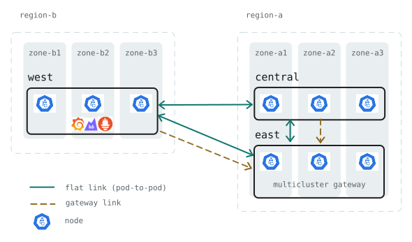
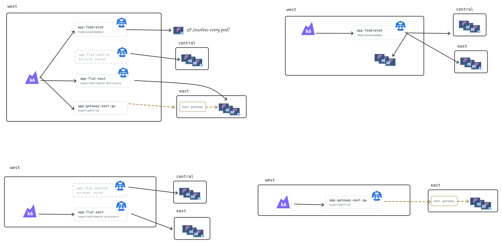
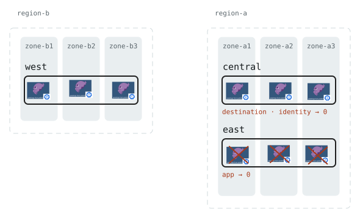
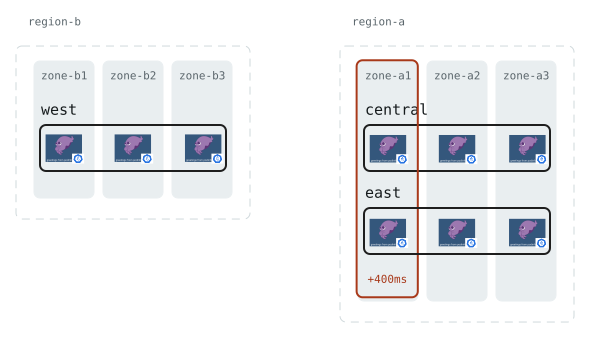
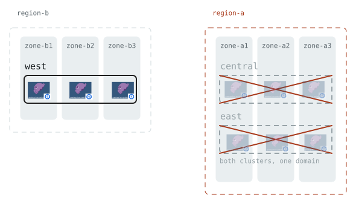

# Cross-cluster disaster recovery: Linkerd chaos experiments

This repository contains a local setup to run a **cross-cluster Disaster Recoverty exercise** against Linkerd.
It uses [k3d](https://k3d.io/stable/) to create three clusters on a shared Docker network, simulating a multi-region cloud setup, with workload exposed using the three Linkerd [multi-cluster modes](https://linkerd.io/2-edge/features/multicluster/). It then tests various failure scenario: mesh control plane, cluster, zone, and region failure. 

**[▶ Browse the recorded runs](https://riccap.github.io/linkerd-cross-cluster-dr-demo/)** to visualize the past experiments that are committed along with the repo.

## Limitations
While experiments are designed and verified by hand and against official documentation, this repo was generated using AI, and heavily relies on bash scripts and a lot of glue code. This repo is not aimed to be replicated 1:1 in production, but is used as evidence to make claims about Linekerd behaviours during chaos tests.

If you want to replicate these experiments in your clusters, here's a quick checklist to make your experiments reproducible:
1. Choose a load generator that can keep track of experiments (e.g., [k6](https://k6.io/) or [Gatling](https://gatling.io/download-gatling-community-edition))
2. Choose a consistent way to inject faults (e.g., [Chaos Mesh](https://chaos-mesh.org/) or [Litmus Chaos](https://litmuschaos.io/))
3. Avoid glue code and bash scripts to implement your runs, but rely on controlled checkpoints and reproducible workflows.

## What it builds





## The experiments

Each runs starts from a baseline traffic, injects the fault, measures, restores, and exits non-zero if a check fails.

| | Fault | Target | 
|---|---|---|
| `task fm0` | *none* | — | 
| `task fm1` | control plane | `central`  |
| `task fm2` | cluster | `east` | 
| `task fm3` | zone brownout | one zone, every cluster |
| `task fm4` | region | `region-a` = `east` + `central` | 
| `task fm5` | trust anchor | `east` | nothing, at first |

### Experiment 1


### Experiment 2


### Experiment 3


### Experiment 4


### Experiment 3


To run a simulation, you can use the Taskfile provided in the repo.
```bash
task fm2 VARIANT=hard     # create network partition
task fm1 MODE=identity    # simulate failure of identity service
```

The results land in `results/<profile>/<run>/`.

**Run `task fm0` before any run that matters.** This verifies the baseline and is a prerequisite for the experiments.

## How to run it
Find out more in how to run the simulation yourself.

## Credits

The flat-network approach — per-cluster CIDRs plus the `jq` + `docker exec`
route mesh — comes from Buoyant's
[k3d-multicluster-playground](https://github.com/BuoyantIO/k3d-multicluster-playground)
(itself derived from work by alpeb and olix0r), generalised here from two
clusters to N. That repo is a HAZL demo; this one is a DR harness, so the rest is new.

## License

[Apache 2.0](LICENSE).
